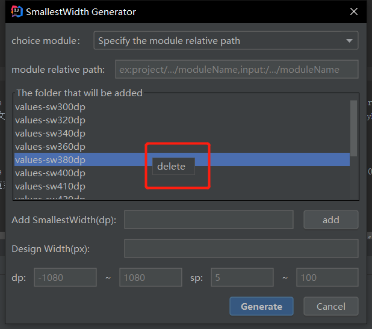

# SmallestWidthPlugin

一款可一键生成values-sw\<N\>dp文件夹及dimens.xml文件的插件

安装插件后可通过快捷键ALT+P或者Tools|SmallestWidth

插件界面如图：

    1.插件启动后可自主选择要在那个moudel下生成values-sw\<N\>dp文件夹;
    2.通过Add smallestWidth添加需要的屏幕最小尺寸，如540，则会生成values-sw540dp文件夹。可输入多个文件夹以“，”或“,”分隔，如：540，580或540,580
    3.Design Width 为你设计稿的尺寸，如设计稿最小宽度为1080px,则输入1080

右键可删除文件夹

1.在values和values-sw\<N\>dp文件夹下
> 如果没有dimens.xml文件，则会自动生成dimens.xml;

> 如果有dimens.xml文件，则会先删除原来的dimens.xml，再生成新的dimens.xml；

生成后的文件夹如下图：

