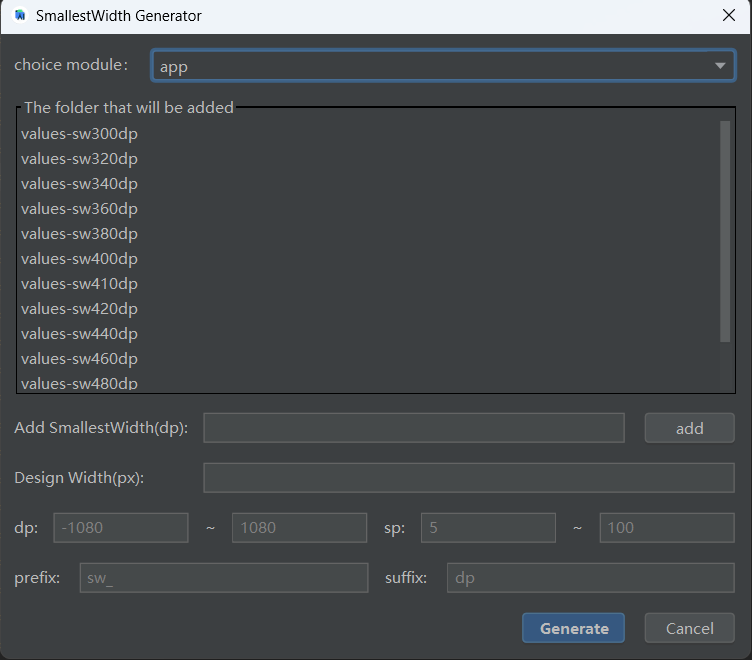
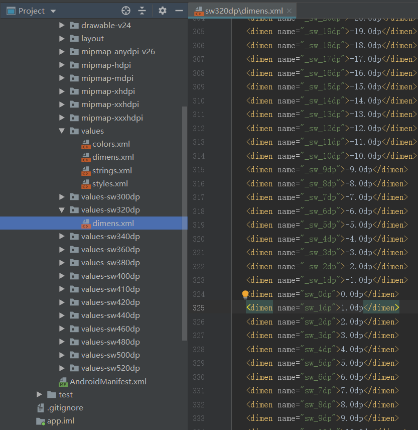

# SmallestWidthPlugin

一款可一键生成values-sw\<N\>dp文件夹及dimens.xml文件的插件

安装插件后可通过快捷键ALT+P或者Tools|SmallestWidth

插件界面如图：

1.插件启动后可自主选择要在那个moudel下生成values-sw\<N\>dp文件夹;
2.默认列表内有一些文件夹，你也可以通过Add smallestWidth添加需要的尺寸;
3.Design Width 为你设计稿的尺寸是必填项。

1.在values文件夹下
> 如果没有dimens.xml文件，会以插件列表中最大的sw自动生成dimens.xml;

> 如果有dimens.xml文件，会判断是否有name相同的节点有则修改，没有则添加；

2.values-sw\<N\>dp文件夹下
> 如果values-sw\<N\>dp\\dimens.xml文件不存在,会自动生成values-sw\<N\>dp\\dimens.xml文件；

> 如果values-sw\<N\>dp\\dimens.xml文件存在,会判断是否有name相同的节点有则修改，没有则添加；

生成后的文件夹如下图：

